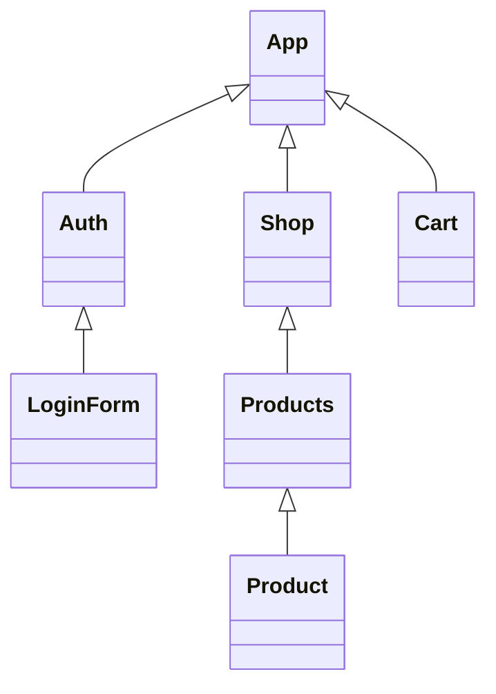

# Introducing React Context




There is not direct connection from LoginForm to Cart

### AuthContext Provider

App.js

```REACT
         <AuthContext.Provider value={
      {
        isLoggedIn: false
      }
    }>
      <MainHeader isAuthenticated={isLoggedIn} onLogout={logoutHandler} />
      <main>
        {!isLoggedIn && <Login onLogin={loginHandler} />}
        {isLoggedIn && <Home onLogout={logoutHandler} />}
      </main>
    </AuthContext.Provider>
```

**AuthContext Provider** is a component that we can use in our JSX code, and we can wrap it around other components and those toher components and all their descendat components, so all their children and their children's children and so on,  all those component will now hace access to that Context.

Listening Part:

We can listen in 2 ways:
We can liten by using AuthContext consumer or by using a React Hook.

Now we'll tipicalyy use React Hook but let me show you other alternative to consumer as well

### AuthContext Consumer

In Navgation.js

```react
const Navigation = (props) => {
  return (
    <AuthContext.Consumer>
      {(ctx) => {
        return (<nav className={classes.nav}>
          <ul>
            {ctx.isLoggedIn && (
              <li>
                <a href="/">Users</a>
              </li>
            )}
            {ctx.isLoggedIn && (
              <li>
                <a href="/">Admin</a>
              </li>
            )}
            {ctx.isLoggedIn && (
              <li>
                <button onClick={props.onLogout}>Logout</button>
              </li>
            )}
          </ul>
        </nav>)
      }}

    </AuthContext.Consumer>
  );
};
```

The consumer works a bit differently though, the consumer takes a child which actually should be a function, and as a argument you'll get your Context data

## useContext Hook

```react
const Navigation = (props) => {
  const ctx = useContext(AuthContext)
  return (<nav className={classes.nav}>
    <ul>
      {`ctx`.isLoggedIn && (
        <li>
          <a href="/">Users</a>
        </li>
      )}
      {ctx.isLoggedIn && (
        <li>
          <a href="/">Admin</a>
        </li>
      )}
      {ctx.isLoggedIn && (
        <li>
          <button onClick={props.onLogout}>Logout</button>
        </li>
      )}
    </ul>
  </nav>)
};

```

## Context Limitations

Use context for state management across components or possibly across the entire app .

- React Context is NOT optimized for high frequency changes.
- React Context also shouldn't be used to replace ALL component communications and props.

